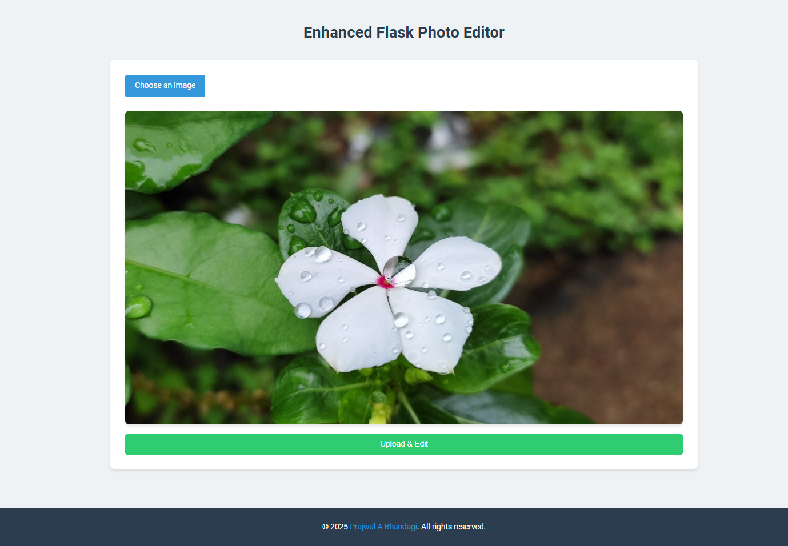
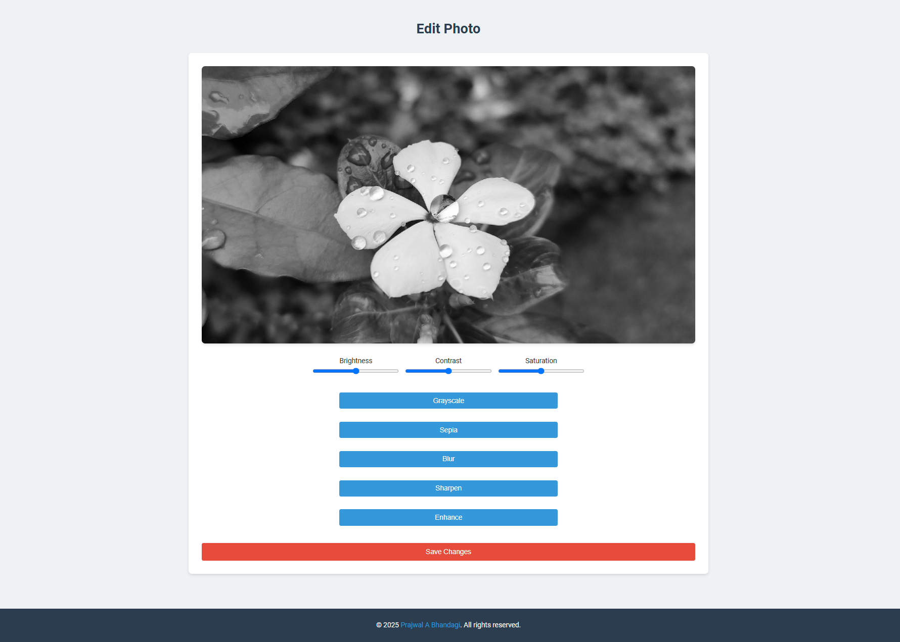
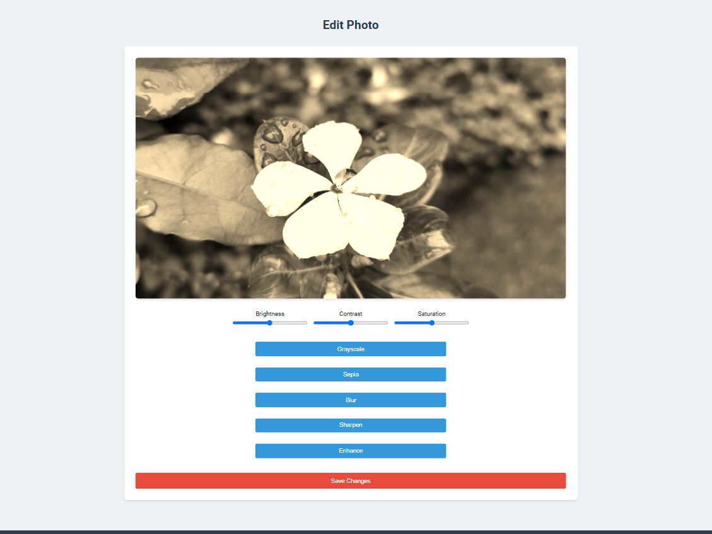
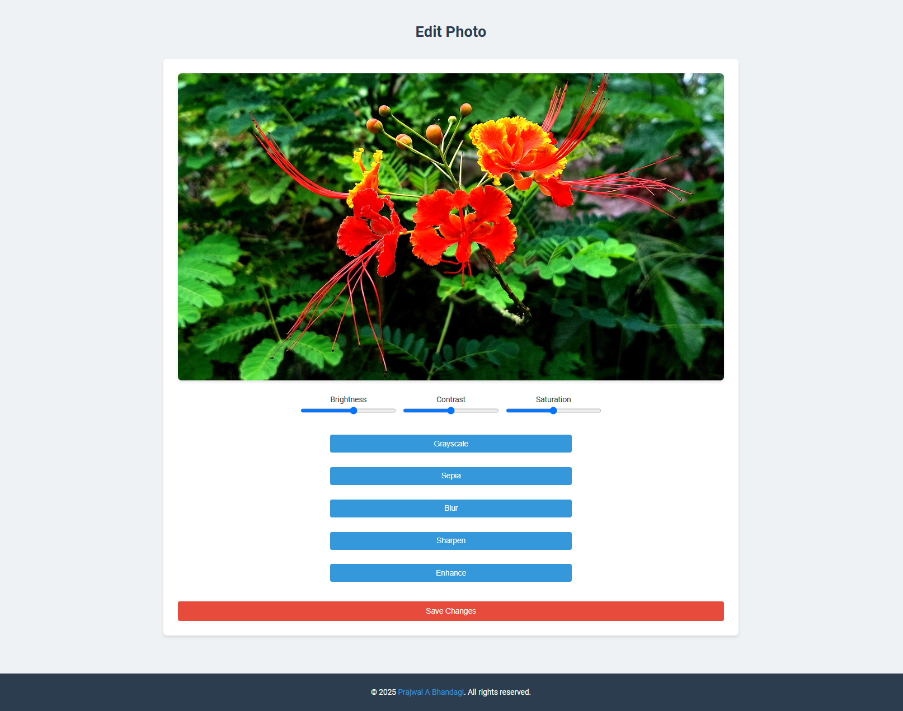

# 🖼️ Image Filter Web Application

A powerful and user-friendly web application that allows users to apply various filters and enhancements to their images. Built with Python Flask and PIL(Pillow) (Python Imaging Library).

## 🌟 Key Features

### Image Processing Capabilities
- **Basic Filters**
  - Grayscale conversion
  - Sepia tone effect
  - Blur effect
  - Image sharpening
  - Contrast enhancement

### User Experience
- Intuitive drag-and-drop interface
- Real-time filter preview
- One-click filter application
- Batch processing support
- Mobile-responsive design

### Security & Performance
- Secure file handling with Werkzeug
- Optimized image processing
- Input validation
- Error handling
- File type verification

## 📸 Application Preview

<div align="center">
  
  
</div>

<div align="center">
  
  
</div>

## 🚀 Quick Start

### Prerequisites
```bash
Python 3.7+
pip (Python package manager)
Virtual environment (recommended)
```

### Installation Steps
1. Clone the repository:
```bash
[git clone https://github.com/yourusername/image-filter-app.git](https://github.com/prajwal032004/Flask-Image-Processing-Application.git)
cd Flask-Image-Processing-Application
```

2. Set up virtual environment:
```bash
python -m venv venv
source venv/bin/activate
# On Windows: venv\Scripts\activate
```

3. Install dependencies:
```bash
pip install flask pillow
```

4. Launch application:
```bash
python app.py
```

## 💡 Usage Guide

1. **Upload Image**
   - Click upload button or drag-and-drop
   - Supported formats: PNG, JPG, JPEG, GIF
   - Max file size: 10MB

2. **Apply Filters**
   - Select filter from sidebar
   - Adjust parameters if available
   - Preview changes in real-time

3. **Save Results**
   - Download processed image
   - Share directly (coming soon)
   - Batch export (coming soon)

## 🛠️ Technical Architecture

### Project Structure
```
image-filter-app/
├── app.py                 # Application entry point
├── static/               
│   └── uploads/          # Image storage
├── templates/            
│   ├── index.html        # Upload interface
│   └── edit.html         # Filter interface
└── requirements.txt      # Dependencies
```

### Core Components
- **Flask Backend**: Handles routing and file operations
- **PIL Processing**: Image manipulation engine
- **Frontend**: Responsive UI with modern JavaScript
- **Security**: Input validation and secure file handling

## 📝 API Documentation

| Endpoint | Method | Description | Parameters |
|----------|---------|------------|------------|
| `/` | GET | Home page | None |
| `/` | POST | Upload image | `file` (image) |
| `/edit/<filename>` | GET | Editor page | `filename` (str) |
| `/apply_filter` | POST | Process image | `filter_type`, `filename` |

## 🔜 Roadmap

- [ ] Additional filters and effects
- [ ] Batch processing capability
- [ ] User accounts and saved presets
- [ ] Social sharing integration
- [ ] API authentication

## 🤝 Contributing

We welcome contributions! Please follow these steps:

1. Fork repository
2. Create feature branch
3. Commit changes
4. Push to branch
5. Submit pull request

## 📄 License

This project is licensed under the Self License.

## 🙏 Acknowledgments

- [Flask](https://flask.palletsprojects.com/)
- [Pillow](https://python-pillow.org/)
- [Werkzeug](https://werkzeug.palletsprojects.com/)

## 🛫 Reach Me

- Creator: [Prajwal A Bhandagi](https://github.com/prajwal032004)

---
⭐️ Found this project helpful? Give it a star!
